# 1 TCP/IP协议

## 1 介绍

- Transmission Control Protocol/Internet Protocol（传输控制协议/因特网互联协议 又称为 网络通信协议）
- Internet最基本协议，国际互联网基础。
- 由网络层的IP协议和传输层的TCP协议组成（同时还有其他后发展起来的协议 如 ARP、ICMP、IGMP、UDP以及DNS、能自动获取ip的DHCP、还有其他的HTTP/SMTP/FTP等）
- 定义了电子设备如何接入因特网，以及数据如何在他们之间传输的标准。
- 协议采用了4层的层级结构，每一层都呼叫他的下一层所提供的协议来完成自己的需求。
- TCP负责发现传输的问题，已有问题就发出信号，要求重新传输，知道所有数据安全正确的传输到目的地。
- IP 是给因特网的每一台联网设备规定一个地址

### 1.1 TCP/IP四层模型

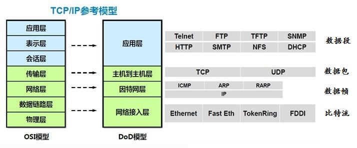

# 2 IP协议

## 1 介绍

- 将多个包交换网络连接起来。在原地址和目的地址之间传送一种称之为数据包的东西。
- 提供对数据大小的重新组装功能，以适应不同网络对包大小的要求。
- 在OSI参考模型中应用于网络层，以”数据包（Package）“为单位。
- IP地址的定义是确认唯一端口号和路由选择的关键，IP地址相当于每台电话的电话号码，唯一且是我们互相联系的关键，因此IP协议也是网络互连的关键

### 2 IP协议特点

- 是一种无连接、不可靠的分组传送服务的协议
- 是点-点线路的网络层通信协议。IP协议是针对原主机-路由器、路由器-路由器、路由器-目的主机之间的数据传输的点-点线路的网络层通信协议
- 屏蔽了网络在数据链路层、物理层协议与实现技术上的差异，通过IP协议，网络层向传输层提供的是统一的IP分组，传输层不需要考虑互联网在数据链路层、物理层协议与实现技术上的差异。是得异构网络的互连变得容易

### 3 IPv4 和IPv6

### 1 总览

​	目前，主流IP是基于IPv4的，但IPV4网络难以实现网络实名制，一个重要原因就是因为IP资源的共用，因为IP资源不够（IPV4为32位），所以不同的人在不同的时间段共用一个IP，IP和上网用户无法实现一一对应。而IPv6（128位，足够长）的普及将改变现状。

​	因为IPv6一个重要的应用将是实现网络实名制下的互联网身份证/VIeID，在IPv4下，现在根据IP查人也比较麻烦，电信局要保留一段时间的上网日志才行，通常因为数据量很大，运营商只保留三个月左右的上网日志，比如查前年某个IP发帖子的用户就不能实现。IPv6的出现可以从技术上一劳永逸地解决实名制这个问题，因为那时IP资源将不再紧张，运营商有足够多的IP资源，那时候，运营商在受理入网申请的时候，可以直接给该用户分配一个固定IP地址，这样实际就实现了实名制，也就是一个真实用户和一个IP地址的一一对应。当一个上网用户的IP固定了之后，你任何时间做的任何事情都和一个唯一IP绑定，你在网络上做的任何事情在任何时间段内都有据可查，并且无法否认。因此你可能昨晚刚浏览过非法网站后，第二天早上就会有人上门给你开罚款单（啧啧）。

## 2 IPv4

### 2.1 介绍

- 是互联网协议（Internet Protocol，IP）的第四版，也是第一个被广泛使用，构成现今互联网技术的基础的协议。
- IPv4 可以运行在各种各样的底层网络上，比如端对端的串行数据链路（PPP协议和SLIP协议），卫星链路等等。
- 局域网中最常用的是以太网。
- 目前的全球因特网所采用的协议族是TCP/IP协议族，IP是TCP/IP协议族中网络层的协议。是TCP/IP核心协议之一。

### 2.2 数据报格式

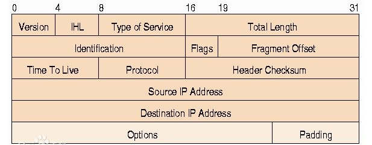

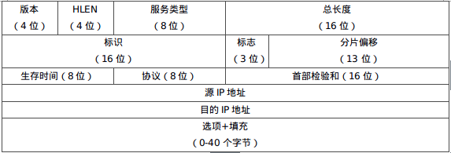

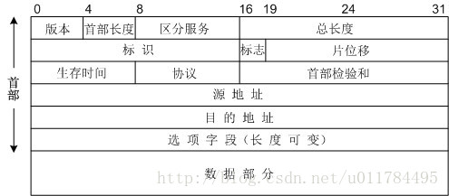

字（word）= 一个或多个字节（Byte） = 8位（bit）

- 首部的长度是以四个字节为单位，长度可以是20-60字节，这跟首部的HLEN字段有关
- **版本** 4比特 ip协议的版本号，分为IPv4和IPv6
- **首部长度** 这个4 bit 字段定义了数据报首部的长度，以4字节的字为单位。当首部没有选项时，首部长度为20字节；当这个字段值为最大值F时，首部长度最大为60字节
- **服务类型**：在最初这个字段有一部分用于定义数据报的优先级，剩下的一部分定义了服务类型。IETF已经改变了这个8位字段的解释，现在定义了一组区分服务。在这种解释种，前6位构成了码点（codepoint），最后两位未使用。当码点字段最右边的3位不全为0时，这6位定义了54种服务，低延时，高吞吐量等等。
- **总长度**：这个16位字段定义了数据报总长度，其以字节为单位。故IPv4数据报总长度上限值位65536字节。注：为什么需要这个字段？在许多情况下，我们确实不需要这个字段值。但是有些情况下，封装在一个帧里的并不仅仅是数据报，还可能附加了一些**填充**。比如，以太网协议对帧的数据有最大值（1500字节）和最小值（46字节）的限制，当数据小于46字节时，数据将含有填充数据
- **标识（identification）：　**这个16位字段标志了从源主机发出的一个数据报，这样就确定了数据报的唯一性。这样使得数据报被分片后，在到达终点时终点能根据标识号将同一个数据报的分片重新组装成一个数据报。
- **标志（flag）：**第一位保留（未用），第二位为“不分片（do not fragment）”，第三位位“还有分片（more fragment）”。
- **分片偏移：**这个13位字段表示的是分片在整个数据报中的相对位置。这是数据在原始数据报中的偏移量，以8字节位单位。
- **生存时间：**这个8位字段用来控制数据报所经过的最大跳数（路由器），每经过一个路由器，这个字段数值都减1，减1后变位0时，路由器就丢弃这个数据报。
- **协议：**这个8位字段定义了使用IPv4服务的高层协议，如TCP，UDP，ICMP，IGMP，OSPF等的数据都将被封装到IP数据报中。这个字段指明数据报必须交付给哪个最终目的协议。
- **检验和：**检验IP数据报首部。
- **源地址：**定义了源点的IP地址，这个字段始终保持不变。
- **目的地址：**定义了终点的IP地址，这个字段始终保持不变。

### 2.3 地址格式

- 长度32位，即有2^32-1个地址
- 一般的书写法为4个用小数点分开的十进制数。也有人把4位数字化成一个十进制长整数，但这种标示法并不常见。
- 过去IANAIP地址分为A,B,C,D 4类，把32位的地址分为两个部分：前面的部分代表网络地址，由IANA分配，后面部分代表局域网地址。如在C类网络中，前24位为网络地址，后8位为局域网地址，可提供254个设备地址(因为有两个地址不能为网络设备使用: 255为广播地址，0代表此网络本身) 。网络掩码(Netmask) 限制了网络的范围，1代表网络部分，0代表设备地址部分，例如C类地址常用的网络掩码为255.255.255.0。
- 由于IPv4最大的问题在于网络地址资源有限，严重制约了互联网的应用和发展。IPv6的使用，不仅能解决网络地址资源数量的问题，而且也解决了多种接入设备连入互联网的障碍。IPV6号称可以为全世界的每一粒沙子编上一个网址。

## 3 IPv6

### 3.1 地址格式

​	IPv6的地址长度为128b，是IPv4地址长度的4倍。于是IPv4点分十进制格式不再适用，采用十六进制表示。IPv6有3种表示方法。

- **冒分十六进制表示法：**

  格式为X:X:X:X:X:X:X:X，其中每个X表示地址中的16b，以十六进制表示，例如：ABCD:EF01:2345:6789:ABCD:EF01:2345:6789，这种表示法中，每个X的前导0是可以省略的，例如：2001:0DB8:0000:0023:0008:0800:200C:417A→ 2001:DB8:0:23:8:800:200C:417A。

- **0位压缩表示法:**

  在某些情况下，一个IPv6地址中问可能包含很长的一段0，可以把连续的一段0压缩为“::”。但为保证地址解析的唯一性，地址中”::”只能出现一次，例如： 
  FF01:0:0:0:0:0:0:1101 → FF01::1101 
  0:0:0:0:0:0:0:1 → ::1 
  0:0:0:0:0:0:0:0 → ::

- **内嵌IPv4地址表示法:**

  为了实现IPv4-IPv6互通，IPv4地址会嵌入IPv6地址中，此时地址常表示为：X:X:X:X:X:X:d.d.d.d，前96b采用冒分十六进制表示，而最后32b地址则使用IPv4的点分十进制表示，例如::192.168.0.1与::FFFF:192.168.0.1就是两个典型的例子，注意在前96b中，压缩0位的方法依旧适用。

### 3.2 报文格式

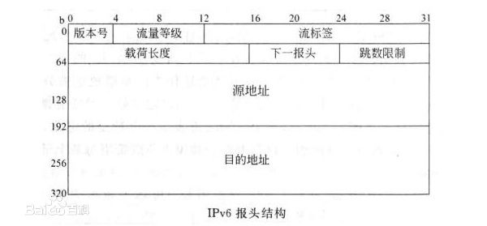

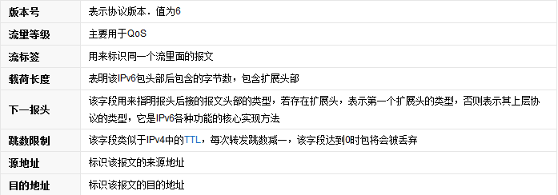

# 3 TCP协议

### 3.1 介绍

- TCP(Transmission Control Protocol 传输控制协议)是一种面向连接的、可靠的，基于IP的传输层协议。
- TCP在IP报文的协议号是6
- 是一个超级麻烦的协议  又是互联网的基础

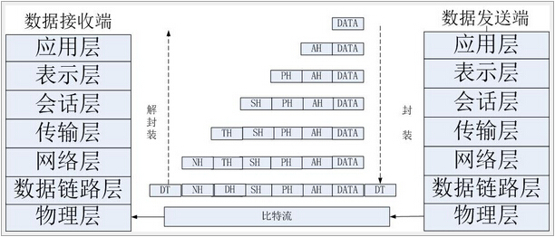

- TCP工作在网络OSI的其七层模型中的第四层--Transport层（传输层）。IP在第三层--Network层,ARP在第二层-Data Link 层（数据链路层）。
- 在第二层的数据，我们把它叫Frame（数据帧），在第三层的数据叫Packet（数据包），第四层的数据叫Segment（数据段）。 同时，我们需要简单的知道，**数据从应用层发下来，会在每一层都会加上头部信息，进行封装**，然后再发送到数据接收端。**所以数据的发送和接收其实就是数据的封装和解封装的过程。 **

### 3.2 报文格式

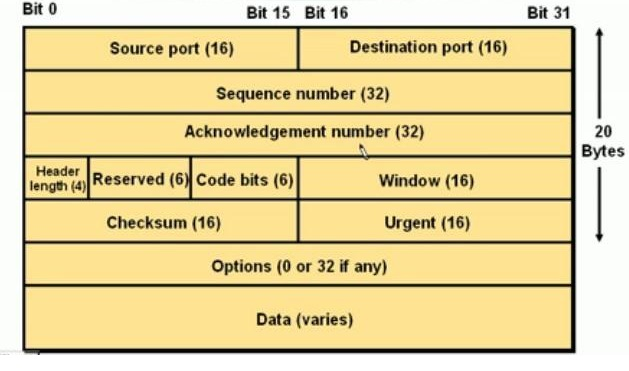

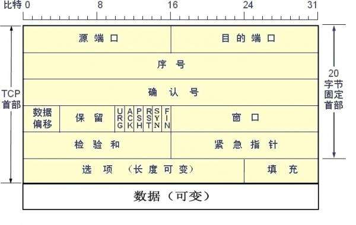

- **Source Port和Destination Port**：分别占用16位，表示源端口号和目的端口号;用于区别主机中的不同进程， 而IP地址是用来区分不同的主机的，源端口号和目的端口号配合上IP首部中的源IP地址和目的IP地址就能唯一 的确定一个TCP连接；

- **Sequence Number：**用来标识从TCP发端向TCP收端发送的数据字节流，它表示在这个报文段中的的第一个数据字节在数据流中的序号;主要用来解决网络报乱序的问题；
- **Acknowledgment Number：**32位确认序列号包含发送确认的一端所期望收到的下一个序号，因此，确认序号应 当是上次已成功收到数据字节序号加1。不过，只有当标志位中的ACK标志(下面介绍)为1时该确认序列号的字 段才有效。主要用来解决不丢包的问题；
- **Offset：**给出首部中32 bit字的数目，需要这个值是因为任选字段的长度是可变的。这个字段占4bit(最多能 表示15个32bit的的字，即4*15=60个字节的首部长度)，因此TCP最多有60字节的首部。然而，没有任选字段， 正常的长度是20字节；
- **TCP Flags:**TCP首部中有6个标志比特，它们中的多个可同时被设置为1，主要是用于操控TCP的状态机的，依次 为URG，ACK，PSH，RST，SYN，FIN。
  URG：此标志表示TCP包的紧急指针域(后面马上就要说到)有效，用来保证TCP连接不被中断，并且督促 中间层设备要尽快处理这些数据；
  ACK：此标志表示应答域有效，就是说前面所说的TCP应答号将会包含在TCP数据包中;有两个取值：0和1， 为1的时候表示应答域有效，反之为0；
  PSH：这个标志位表示Push操作。所谓Push操作就是指在数据包到达接收端以后，立即传送给应用程序， 而不是在缓冲区中排队；
  RST：这个标志表示连接复位请求。用来复位那些产生错误的连接，也被用来拒绝错误和非法的数据包；
  **SYN**：表示**同步序号**，用来建立连接。SYN标志位和ACK标志位搭配使用，当连接请求的时候，SYN=1， ACK=0；连接被响应的时候，SYN=1，ACK=1；这个标志的数据包经常被用来进行端口扫描。扫描者发送 一个只有SYN的数据包，如果对方主机响应了一个数据包回来 ，就表明这台主机存在这个端口;但是由于这 种扫描方式只是进行TCP三次握手的第一次握手，因此这种扫描的成功表示被扫描的机器不很安全，一台安全 的主机将会强制要求一个连接严格的进行TCP的三次握手；
- **Window**：窗口大小，也就是有名的滑动窗口，用来进行流量控制。这是一个复杂的问题，需要新建md。

# 4 UDP 协议

## 4.1 介绍

- 是User Datagram Protocol的简称。中文名是用户数据报协议。
- 是OSI(Open System Interconnection，开放式系统互联)参考模型中一种无连接的传输层协议。
- 提供面向事物的简单不可靠信息传送服务
- 在IP报文的协议号是 17
- 与TCP一样，UDP直接位于IP(网际协议)协议的顶层。
- 属于传输层协议
- 主要作用是将网络数据流量压缩成数据包的形式
- 一个典型的数据包就是一个二进制数据的传输单位。每一个数据包的前8个字节（16*4位）用来包含报头信息，剩余字节则用来包含具体的传输数据。

## 4.2 报文格式

- 是非面向连接的不可靠协议，因此没有了SYN等处理两端等待或连接的报文段。
- UDP的报文格式更为简单，主要由报文头（由均16位的源端口号、目的端口号、UDP长度和UDP校验和组成）和具体传输数据组成
- **UDP长度**：UDP报文的整个大小，最小为8个字节（16*4位）（仅为首部）。
- **UDP检验和**：在进行检验和计算时，会添加一个**伪首部**一起进行运算。伪首部（占用12个字节）为：4个字节的源IP地址、4个字节的目的IP地址、1个字节的0、一个字节的数字17、以及占用2个字节UDP长度。这个伪首部不是报文的真正首部，只是引入为了计算校验和。相对于IP协议的只计算首部，UDP检验和会把首部和数据一起进行校验。接收端进行的校验和与UDP报文中的校验和相与，如果无差错应该全为1。如果有误，则将报文丢弃或者发给应用层、并附上差错警告。

## 4.3 UDP特性

-  UDP是一个**无连接协议**，传输数据之前源端和终端不建立连接，当 UDP想传送时就简单地去抓取来自应用程序的数据，并尽可能快地把它**扔到网络上**。在发送端，UDP传送数据的速度仅仅是受应用程序生成数据的速度、计算机的能力和传输带宽的限制；在接收端，UDP把每个消息段放在队列中，应用程序每次从队列中读一个消息段。
-  由于传输数据不建立连接，因此也就**不需要维护连接状态，包括收发状态等**，因此一台服务机可同时向多个客户机传输相同的消息。
-  UDP信息包的标题很短，只有8个字节，相对于TCP的20个字节信息包的额外开销很小。
-  吞吐量不受拥挤控制算法的调节，只受应用软件生成数据的速率、传输带宽、源端和终端主机性能的限制。
-  UDP使用尽最大努力交付，即不保证可靠交付，因此主机不需要维持复杂的链接状态表（这里面有许多参数）。
-  **UDP是面向报文的**。发送方的UDP对应用程序交下来的报文，在添加首部后就向下交付给IP层。既不拆分，也不合并，而是保留这些报文的边界，因此，应用程序需要选择合适的报文大小。 虽然UDP是一个不可靠的协议，但它是分发信息的一个理想协议。例如，在屏幕上报告股票市场、在屏幕上显示航空信息等等。UDP也用在路由信息协议RIP（Routing Information Protocol）中修改路由表。在这些应用场合下，如果有一个消息丢失，在几秒之后另一个新的消息就会替换它。UDP广泛用在多媒体应用中，例如，Progressive Networks公司开发的RealAudio软件，它是在因特网上把预先录制的或者现场音乐实时传送给客户机的一种软件，该软件使用的RealAudio audio-on-demand protocol协议就是运行在UDP之上的协议，大多数因特网电话软件产品也都运行在UDP之上。
-  在选择使用协议的时候，**选择UDP必须要谨慎**。在网络质量令人十分不满意的环境下，UDP协议数据包丢失会比较严重。**但**是由于UDP的特性：它不属于连接型协议，因而具有**资源消耗小，处理速度快的优点，所以通常音频、视频和普通数据在传送时使用UDP较多**，因为它们即使偶尔丢失一两个数据包，也不会对接收结果产生太大影响。比如我们聊天用的ICQ和QQ就是使用的UDP协议。

# 5 HTTP 协议

## 5.1 介绍

- 超文本传输协议（HTTP,HyperText Transfer Protocol）是互联网上应用最为广泛的一种网络协议。所有的万维网WWW（World Wide Web）文件都必须遵守这个标准。
- 设计HTTP最初的目的是为了**提供一种发布和接收HTML页面的方法**。
- HTTP是一个基于TCP/IP通信协议来传递数据（HTML 文件, 图片文件, 查询结果等）。HTTP是一个属于应用层的面向对象的协议，
- 由于其简捷、快速的方式，适用于分布式超媒体信息系统。
- HTTP协议工作于客户端-服务端架构为上。浏览器作为HTTP客户端通过URL向HTTP服务端即WEB服务器发送所有请求。Web服务器根据接收到的请求后，向客户端发送响应信息。

## 5.2 特点

　**HTTP是一个客户端和服务器端请求和应答的标准**，通常，由HTTP客户端发起一个请求，建立一个到服务器指定端口（默认是80端口）的TCP连接。HTTP服务器则在那个端口监听客户端发送过来的请求。一旦收到请求，服务器（向客户端）发回一个状态行。

**HTTP使用TCP而不是UDP**的原因在于（打开）一个网页必须传送很多数据，而TCP协议提供传输控制，按顺序组织数据，和错误纠正。

- **简单快速**：客户向服务器请求服务时，只需传送请求方法和路径。请求方法常用的有GET、HEAD、POST。每种方法规定了客户与服务器联系的类型不同。由于HTTP协议简单，使得HTTP服务器的程序规模小，因而通信速度很快。
- **灵活**：HTTP允许传输任意类型的数据对象。正在传输的类型由Content-Type加以标记。
- **无连接**：无连接的含义是限制**每次连接只处理一个请求**。**服务器处理完客户的请求，并收到客户的应答后，即断开连接。**采用这种方式可以节省传输时间。
- **无状态：**HTTP协议是无状态协议。**无状态是指协议对于事务处理没有记忆能力**。缺少状态意味着如果后续处理需要前面的信息，则它必须重传，这样可能导致每次连接传送的数据量增大。另一方面，在服务器不需要先前信息时它的应答就较快。
- 支持B/S及C/S模式。

## 5.3 HTTP的URL地址

URL是一种特殊类型的URI，包含了用于查找某个资源的足够的信息，URL,全称是UniformResourceLocator, 中文叫统一资源定位符,是互联网上用来标识某一处资源的地址。以下面这个URL为例，介绍下普通URL的各部分组成：

http://www.cnblogs.com:8080/fzz9/index.jsp?id=30303&page=2#name

- **协议部分**：一般为HTTP或Https，后接//作为分隔符。
- **域名部分**：www.cnblogs.com为网站域名。
- **端口号部分**：此网址为8080。跟在域名后面的是端口号，域名和端口之间使用“:”作为分隔符。端口不是一个URL必须的部分，如果省略端口部分，将采用默认端口(80)。
- **虚拟目录部分**：从域名后的第一个“/”开始到最后一个“/”为止，是虚拟目录部分。虚拟目录也**不是**一个URL必须的部分。
- **参数部分**：从“？”开始到“#”为止之间的部分为参数部分。本例中的参数部分为“id=30303&page=2”。**不是**必要部分。
- **文件名部分**：从域名后的最后一个“/”开始到后面一个“？”为止，是文件名部分，如果没有“?”,则是从域名后的最后一个“/”开始到“#”为止，是文件部分，如果没有“？”和“#”，那么从域名后的最后一个“/”开始到结束，都是文件名部分。本例中的文件名是“index.jsp”。文件名部分也**不是**一个URL必须的部分，如果省略该部分，则使用默认的文件名。
- **锚部分**：从“#”开始到最后，都是锚部分。本例中的锚部分是“name”。锚部分也**不是**一个URL必须的部分。

## 5.4 HTTP请求之request

客户端通过HTTP协议进行请求时遵循一定的格式，请看下面的请求报文格式（**由请求行、请求头、空行、请求体组成**）：

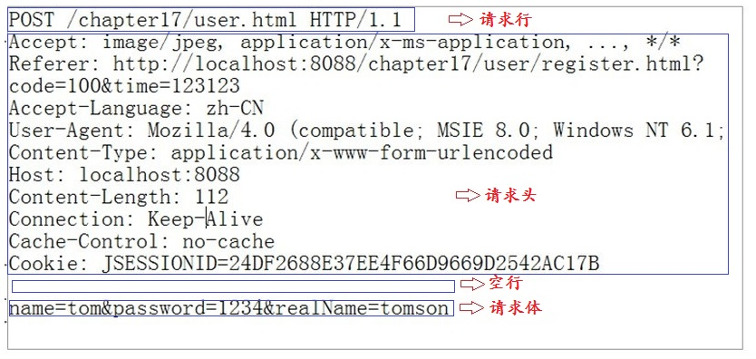

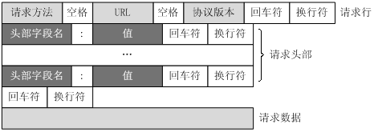

## 5.5 Http响应之response

在客户端发送请求后服务端进行响应，将信息发送给客户端，以实现功能服务，报文格式如下（**包含状态行、响应头、空行、消息体**）：

