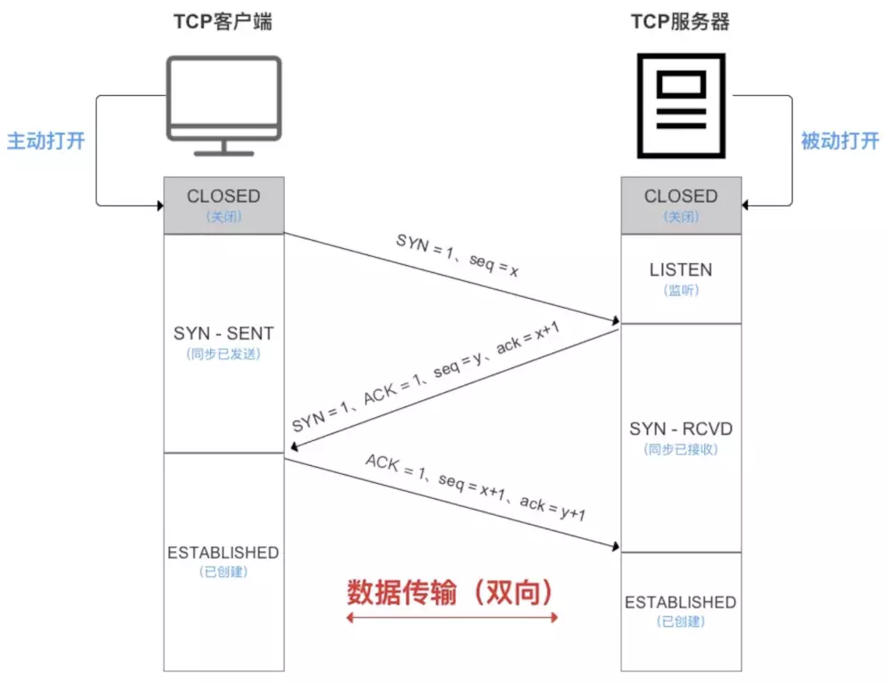
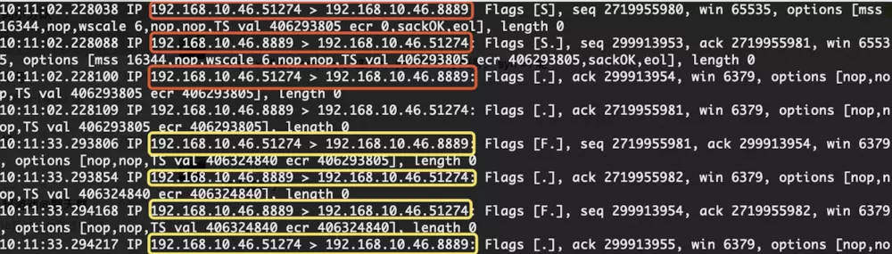
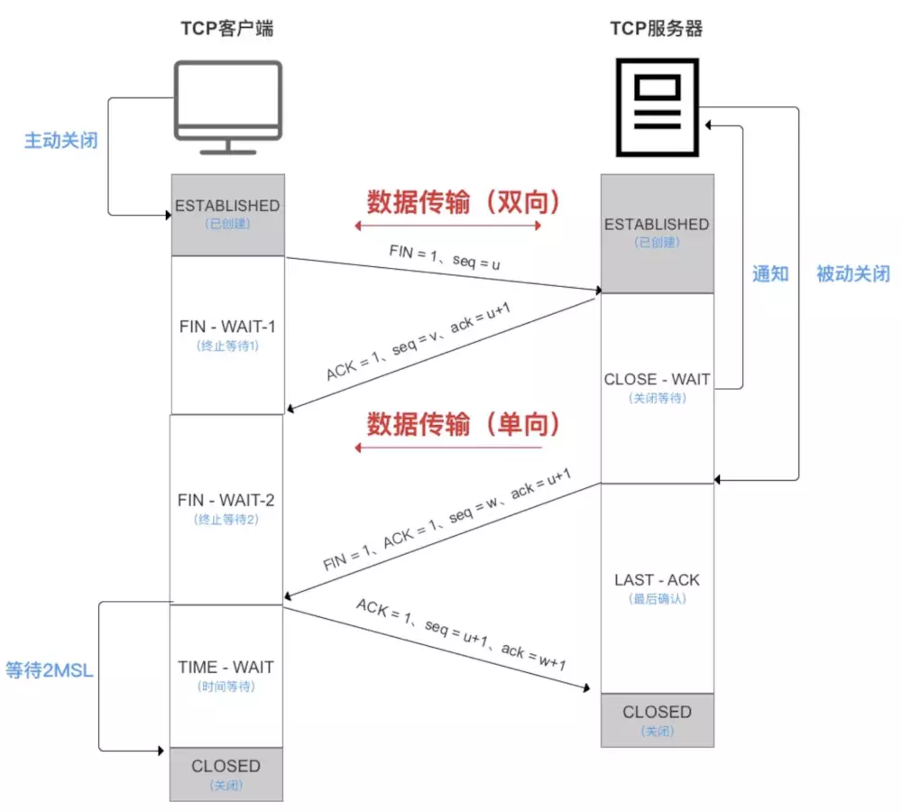

# TCP三次握手、四次挥手

## 1 tcp报文头部的一些信息

- ACK:表示应答域有效，有两个值0和1，tcp三次握手时第一次发送时ACK为0。1表示应答域有效，反之为0。
- Acknowledge Number:确认序号，确认序号应该是上次成功接受的序号+1，表示期望下一次收到的序号。主要用来解决不丢包的问题。（相当于表示上一次的内容成功接收到了）。
- Sequence Number：序号，表示报文中第一个字节在发送的数据流中的序号，解决乱序的问题。Sequence Number 是跟Acknowledge Number 一起使用的，举个例子，主机1发送了Sequence Number = x 给主机2，那么主机2收到之后就将Acknowledge Number 设置为x+1，意思是这次的消息收到了，下次主机1应该发送的下一个Sequence Number为 X+1
- SYN：同步序号，用来建立连接，SYN与ACK一起搭配使用，tcp第一次握手时（连接请求）SYN = 1,ACK = 0,tcp第二次握手时（相应连接）SYN = 1,ACK = 1(这个标志的数据包经常被用来进行端口扫描。扫描者发送一个只有SYN的数据包，如果对方主机相应了一个数据包回来，就表明这台主机存在这个端口；但是由于这种扫描方式只是进行TCP三次握手的第一次握手，因此这种扫描的成功表示被扫描的机器很不安全，一台安全的主机将会强制要求一个连接严格的进行TCP的三次握手)
- FIN：表示发送端已经达到数据末尾，也就是说双方的数据传送完成，没有数据可以传送了，发送FIN标志位的TCP数据包后，连接将被断开。

## 2 三次握手

​	三次握手指的是建立一个TCP连接需要客户端和服务器一共发送三个包。三次握手的目的是连接服务器指定端口，建立TCP连接，并同步连接双方的序列号，和确认号，交换TCP窗口大小信息。在socket编程中，客户端执行connect()时，将触发三次握手。

​	通过抓包可以看到具体，红框表示三次握手，黄框表示四次挥手。可以看到发送的标记位、序列号和确认号。

​	

​	首先客户端服务端都是出于关闭状态，知道客户端主动打开连接，服务端会被动打开连接，服务端现在出于listen状态。

### 2.1 SYN ACK Seq是啥

SYN,ACK是TCP的标记位，TCP的标记位一共有6种

- SYN (synchronous建立联机)
- ACK (acknowledgement 确认)
- PSH (push传送) 
- FIN (finish结束)
- RST (reset重置)
- URG (urgent 紧急)
- Sequence number(顺序号码)
- Acknowledge number (确认号码)

### 2.2握手过程

- 第一次握手（SYN=1,seq =x）

  客户端A发送一个位码SYN=1,然后会随机产生一个序列号seq=1234567的数据包到服务器，这个时候服务器收到SYN=1知道了客户端A要求建立连接。客户端A此时出于SYN_SEND状态。

- 第二次握手（SYN=1,ACK=1,seq=y,ack=x+1）

  服务器收到请求连接信息之后要确认联机信息，向主机A发送 ack number = (主机A的seq+1)，SYN = 1，ACK =1，随机产生一个序列号seq = 7654321.此时服务器处于SYN_RCVD状态。

- 第三次握手（ACK=1 ack = y+1）

  主机A收到后检查ack number是否正确，即第一次发送的seq number+1,以及位码 ack是否为1，若正确，主机A会在发送ack number = (服务器seq+1),ack=1，然后主机A进入ESTABLISHED 状态，服务器收到后确认seq值与ack=1则连接建立成功，服务器也进入ESTABLISHED状态。

### 2.3 为什么TCP建立连接要进行三次握手

​	防止服务器因接收了早已失效的连接请求报文，从而一直等待客户端请求，最终导致形成死锁，浪费资源。

## 3 四次挥手

​	通信结束后，双方都需要释放连接，需要四次挥手。

### 3.1 挥手过程

- 第一次挥手（FIN = 1,seq = u ）

  客户端想要关闭连接，会发送一个标记位FIN=1的包，表明没有数据可以发送了，但是仍然可以接收数据。

  此时客户端处于FIN_WAIT_1状态

- 第二次挥手（ACK=1,ack=u+1）

  服务端收到了客户端的FIN包，然后发送一个ACK=1的确认包，表明自己接收到了客户端的关闭请求，但是还没准备好关闭。服务端发送完毕之后，进入CLOSE_WAIT状态。客户端收到这个包的时候进入FIN_WAIT_2状态。

- 第三次挥手（FIN = 1,seq=w）

  当服务端准备好关闭连接的时候，向客户端发送FIN=1,表明自己准备好关闭连接了。发送完毕之后服务端进入LAST_ACK状态，等待客户端的最后一个确认ACK。

- 第四次挥手（ACK=1,ack=w+1）

  客户端接收到了服务端的关闭请求之后，发送最后一个ACK=1的确认包，然后进入到TIME_WAIT状态，等待可能出现的ACK包。服务器收到最后一个ACK之后，确认关闭连接，进入CLOSE状态

  客户端在等待了某个固定时间之后，没有收到服务端的ACK,就人物服务端已经正常关闭连接了，于是也将自己的连接关闭了，进入CLOSE状态。

## 4 各个状态的意义

- LISTEN：侦听来自远方TCP端口的连接请求
- SYN-SENT: 在发送连接请求后等待匹配的连接请求
- SYN-RECEIVED: 在收到和发送一个连接请求后等待对连接请求的确认
- ESTABLISHED: 代表一个打开的连接，数据合一传送给用户
- FIN-WAIT-1: 等待远程TCP的连接中断请求，或者先前的连接中断请求的确认
- FIN-WAIT-2:从远程TCP等待连接中断请求
- CLOST-WAIT: 等待从本地用户发来的连接中断请求；
- CLOSING: 等待远程TCP对连接中断的确认
- LAST-ACKL: 等待原来发向远程TCP的连接中断的确认
- TIME-WAIT: 等待足够的时间以确保远程TCP接收到连接中断请求的确认；
- CLOSED: 没有任何连接状态

## 5 三种TCP状态

### 5.1 SYN_RECV

服务端收到建立连接的SYN没有收到ACK包的时候处在SYN_RECV状态。有两个相关系统配置：

- net.ipv4.tcp_synack_retries:INTEGER

  默认是5 

  对于远程连接请求的SYN,内核会发送SYN+ACK的数据报，已确认收到上一个SYN的连接请求包，这就是所谓的三次握手机制的第二个步骤。这里决定内核在放弃连接之前所送出的SYN+ACK数目。不应该大于255，默认是5，对应于180s左右时间。通常我们不对这个值进行修改，因为我们希望TCP连接不要因为偶尔的丢包而无法连接。

- net.ipv4.tcp_syncookies

  一般服务器都会设置net.ipv4.tcp_syncookies来防止SYN Flood攻击，假设一个用户享服务器发送了SYN报文后突然死机或掉线，那么服务器在发出SYN+ACK应答报文后是无法收到客户端ACK报文的（第三次握手无法完成），这种情况下服务器端一般会重试（再次发送SYN+ACK给客户端）并等待一段时间后丢弃这个未完成的连接，这段时间的长度我们成为SYN Timeout,一般来说这个时间是分钟的数量级（一般是30s - 2m）

  这些处在SYN_RECV的TCP连接成为半连接，并存储在内核的半连接队列中，在内核收到对端发送的ack包时会查找半连接队列，并将符合的request_sock信息存储到完成三次握手的队列中，然后删除此半连接。大量的SYNC_RECV的TCP连接会导致半连接队列溢出，这样后续的连接请求会被内核直接丢弃，这就是SYN Flood攻击。

  能够有效防范SYN Flood攻击的手段之一，就是SYN Cookie。它是对TCP服务端的三次握手协议做一些修改，专门用来防范SYN Flood攻击的一种手段。他的原理是，在TCP服务器端收到的TCP SYN包并返回TCP SYN+ACK包时，不分配一个专门的数据区，而是根据这个SYN包计算出一个cookie值。在收到TCP ACK 包时，TCP服务器在根据那个cookie值检查这个TCP ACK包的合法性。如果合法，再分配专门的数据区进行处理未来的TCP连接。

### 5.2 CLOSE_WAIT

​	发起TCP连接关闭的一方称为client，被动关闭的一方称为Server。被动关闭的Server收到FIN后，但未发出ACK的TCP状态的CLOSE_WAIT.出现这种情况一般都是由于server端代码的问题，如果你的服务器上出现大量的CLOSE_WAIT，应该要考虑检查代码。

### 5.3 TIME_WAIT

​	根据TCP协议定义的三次握手断开连接规定，发起socket主动关闭的一方socket将进入TIME_WAIT状态。TIME_WAIT状态将持续2个MSL(Max Segment Lifetime),在Window下默认为4分钟，即240秒。TIME_WAIT状态下的socket不能被回收利用，具体现象是对于一个处理大量短连接的服务器，如果是服务器主动关闭客户端的连接，将导致服务器端存在大量的出于TIME_WAIT状态的socket,甚至比出于ESTABLISHED状态下的socket多得多，严重影响服务器的处理能力，甚至耗尽可用的socket，停止服务。

## 6 问题

### 6.1 为什么需要TIME_WAIT

​	TIME_WAIT是TCP协议用以保证被重新分配的socket不会受到之前残留的延迟重发报文影响的机制，是必要的逻辑保证。

- 一、保证TCP协议的全双工连接能够可靠关闭

  先说第一点，如果Client直接CLOSED了，那么由于IP协议的不可靠性或者是其它网络原因，导致Server没有收到Client最后回复的ACK。那么Server就会在超时之后继续发送FIN，此时由于Client已经CLOSED了，就找不到与重发的FIN对应的连接，最后Server就会收到RST而不是ACK，Server就会以为是连接错误把问题报告给高层。这样的情况虽然不会造成数据丢失，但是却导致TCP协议不符合可靠连接的要求。所以，Client不是直接进入CLOSED，而是要保持TIME_WAIT，当再次收到FIN的时候，能够保证对方收到ACK，最后正确的关闭连接。

- 二、保证这次连接的重复数据段从网络中消失

  再说第二点，如果Client直接CLOSED，然后又再向Server发起一个新连接，我们不能保证这个新连接与刚关闭的连接的端口号是不同的。也就是说有可能新连接和老连接的端口号是相同的。一般来说不会发生什么问题，但是还是有特殊情况出现：假设新连接和已经关闭的老连接端口号是一样的，如果前一次连接的某些数据仍然滞留在网络中，这些延迟数据在建立新连接之后才到达Server，由于新连接和老连接的端口号是一样的，又因为TCP协议判断不同连接的依据是socket pair，于是，TCP协议就认为那个延迟的数据是属于新连接的，这样就和真正的新连接的数据包发生混淆了。所以TCP连接还要在TIME_WAIT状态等待2倍MSL，这样可以保证本次连接的所有数据都从网络中消失。

## 6.2 TCP关闭连接描述

描述过程：
Client调用close()函数，给Server发送FIN，请求关闭连接；Server收到FIN之后给Client返回确认ACK，同时关闭读通道（不清楚就去看一下shutdown和close的差别），也就是说现在不能再从这个连接上读取东西，现在read返回0。此时Server的TCP状态转化为CLOSE_WAIT状态。
Client收到对自己的FIN确认后，关闭 写通道，不再向连接中写入任何数据。
接下来Server调用close()来关闭连接，给Client发送FIN，Client收到后给Server回复ACK确认，同时Client关闭读通道，进入TIME_WAIT状态。
Server接收到Client对自己的FIN的确认ACK，关闭写通道，TCP连接转化为CLOSED，也就是关闭连接。
Client在TIME_WAIT状态下要等待最大数据段生存期的两倍，然后才进入CLOSED状态，TCP协议关闭连接过程彻底结束。

从上面可以看到，主动发起关闭连接的操作的一方将达到TIME_WAIT状态，而且这个状态要保持Maximum Segment Lifetime的两倍时间。			