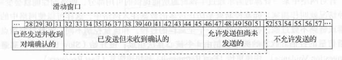
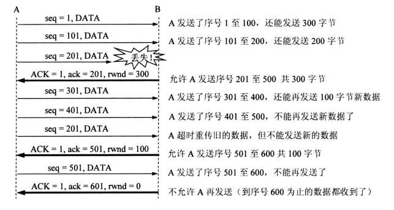

# TCP滑动窗口

## 1 滑动窗口的作用

- 提供TCP的可靠性
- 提供TCP流控特性

## 2 介绍

- TCP的滑动窗口是以**字节**(byte)为单位的。
- TCP窗口大小值是TCP段中一个16bit字段，它代表窗口的字节容量。TCP窗口的最大值为2的16次方，即65535字节。
- 接受者在回复给发送者的每一个确认信息中都通告了自己的窗口大小。这个确认信息可以是报文段，即纯确认信息。也可以被捎带在反向的报文段中传送给发送者。这个窗口的大小，其实是接受者缓存中剩余的空间大小。

## 3 什么是TCP窗口

- 首先，要理解，client和server各自协议栈都有自己的buffer，应用层读写数据的源都是协议栈buffer里。以接收端为例，应用程序调用read()时，会从buffer里移走数据到用户空间，应用程序读的速度越快(read(1024)必然比read(1)要快)，那么buffer里的内容消费的越快，buffer也会越空。那么TCP就可以告诉client，我现在很闲，你可以发送更多的数据来。"更多"是多少？这就说窗口，窗口就是量化接收端和服务端当前能处理数据的能力。

- client和server端建立连接后，client会告诉server，自己的"接收窗口"大小(自己能接收多少的数据，受上面所说的buffer影响)，server端接收到client的"接收窗口"大小，就会变成server端自己的"发送窗口"大小。同样的，server端告诉client自己的"接收窗口"大小，就会变成客户端的"发送窗口"大小。

- 为了理解TCP的窗口大小是怎么样变化的，我们先需要理解它的含义。最简单的方式就是认为窗口大小"意味着接收方能接收数据的大小"，这也是说接收端设备再应用程序读取buffer中数据之前，能从对端连接处理多少数据。比如说server端窗口大小是360，那么就意味着server端一次只能从客户端接收不超过360bytes的数据。当server端收到数据，它会将数据放到buffer里，然后server端必须对这份数据做两件事作者：

  ​   1. server端必须发送一个 ACK 到client端来确认数据已经收到

     	2. server端必须处理这份数据，把它交给对应的应用程序

- 要区分上面两件事对理解窗口很重要，接收方收到数据后会确认，但是数据并不一定是里面就是从buffer里取出的，这是受应用层逻辑控制的。所以很有可能如果接收数据过快，而取出数据更慢，就会导致buffer满。一旦这种情况发生，窗口大小就开始调整来防止接收方负载过高。
- 正是因为窗口大小的调整可以用来调节数据传输的速率，所以就可以实现TCP的流控，在传输层的流控就是典型的例子，流控对于TCP的通信是很重要的，通过增大或者减小窗口的大小，client和server各自确保彼此设备发数据和收数据平衡。

## 4 窗口组成

对于TCP会话**发送端**，任何时候在发送缓存内的数据可以分为4类：

１.　已经发送并得到对端ACK;

２.　已经发送但还没收到ACK;

３.　未发送但对端允许发送；

４.　未发送而对端不允许发送；

我们把“已经发送但还未收到对端ACK的”和“未发送但对端允许发送的”这两部分数据称为发送窗口

对于TCP 的**接收方**，在某一时刻它的接受缓存内的数据可以分为3类：

１.　已接收；

２.　未接收准备接收；

３.　未接收不准备接收；

其中“未接收准备接收”称为接收窗口。

## 5 窗口的组成

TCP是全双工的协议，会话的双方都可以同时接收、发送数据。TCP的双方都维护一个“发送窗口”和一个“接收窗口”。其中各自的“接收窗口”大小取决于应用、系统、硬件的限制（TCP传输的数据不能大于应用的数据处理速率）。各自的“发送窗口”则要求取决于对端通告的窗口大小值。

发送窗口的位置由窗口**前沿**和**后沿**的位置共同确定。发送窗口的后沿有两种可能，即不动（没有收到新的确认）和前移（收到了新的确认）。发送窗口的后沿不可能往后，因为不可能撤销确认。滑动窗口的前沿可能通常是不断向前移动。但也有可能不动，这对应于两种情况：一是没有收到新的确认；二是收到新的确认，但是窗口之缩小了。滑动窗口的前沿也有可能后退，原因是对方通知的窗口之缩小的字节数，大于上一次收到确认号的字节数。但是TCP强烈不建议这么做，因为有可能在收到这个通知之前，已经发送了窗口的大量数据。

对于不按序到达的数据，TCP同常先把它们临时存放在接收窗口中，等字节流中所缺少的字节收到后，再按序交付上层的应用进程。

滑动窗口机制的可靠性简历再“确认重传”的基础上。只有收到发送窗口内字节的ACK确认，才会移动发送窗口的左边界，否则不会移动边界。这样确认了传输失败的段可以得到重传。

## 6 滑动窗口与流量控制

利用滑动窗口实现流量控制，本质就是让发送方的发送速率不要太快，让对方**来得及接收**。发送方的发送窗口**不能超过**接收方给出的**接收窗口的数值**。下面通过一个例子来说明这个过程：

设A与B通信。在连接建立时，B告诉A：“我的接收窗口 rwnd =400”(这里rwnd表示receiver window)，因此发送方的发送窗口不能超过接收方给出的接收窗口的数值。

设每个报文段为100字节常，数据报文段的序号初始值设为1

可以看到，接收方主机B进行了三次流量控制。第一次把窗口减小到 rwnd=300，第二次又减少到rwnd=100，最后减少到0，即不允许对方再发数据。

现在考虑一种情况，B向A发送了rwnd=0的报文段后，过一段时间又有了缓存空间。于是B向A发送了rwnd=400的报文段。然而这个报文段在传输过程中丢失了。那么A和B就会陷入相互等待的死锁中。

为了解决上述的死锁问题，TCP为每一个连接设有一个持续计时器。只要TCP连接的一方收到对方的零窗口通知，就会启动持续计时器。若时间到，就会发送一个零窗口探测报文段，而对方在收到这个零窗口探测报文后，会给出现在的窗口值。如果这个窗口值不是零，那么死锁僵局就会被打破。