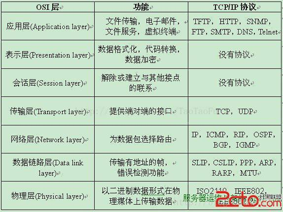

# 计算机网络层次划分及协议了解

## 1 网络层次划分

​	将所有的协议综合起来，各个层次的所有协议被称为协议栈。因特网的协议栈由5个层次组成：物理层、链路层、网络层、传输层和应用层。这个划分方法称为TCP/IP五层协议。除此之外，还有OSI七层模型和TCP/IP四层协议。它们之间的对应关系如下：

比较常用的是TCP/IP五层协议

### 1.1 应用层

​	应用层是网络应用程序以及他们的应用层协议存留的地方。因特网应用层包括许多协议，例如HTTP(Web的主要协议)、SMTP（邮件传输）、FTP(文件传输)等，再比如我们每天都在使用的DNS域名系统

​	为操作系统或网络应用程序提供访问网络服务的接口。

会话层、表示层和应用层重点：

- **1> 数据传输基本单位为报文；**
- **2> 包含的主要协议：FTP（文件传送协议）、Telnet（远程登录协议）、DNS（域名解析协议）、SMTP（邮件传送协议），POP3协议（邮局协议），HTTP协议（Hyper Text Transfer Protocol）。**
- 3> 规定发送方与接收方必须使用一个固定长度的消息头，消息头必须使用某种固定的组成，消息头必须记录消息体长度等信息，以方便接收方能正确的解析发送方发送的数据。

### 1.1.1 表示层

​	表示层对上层数据或信息进行变换以保证一个主机应用层信息可以被另一个主机的应用程序理解。表示层的数据转换包括数据的加密、压缩、格式转换等。

### 1.1.2 会话层

​	会话层管理主机之间的会话进程，即负责建立、管理、终止进程之间的会话。会话层还利用在数据中插入校验点来实现数据的同步。

### 1.2 传输层

​	第一个端到端，即主机到主机的层次。传输层负责将上层数据分段并提供端到端的、可靠的或不可靠的传输。此外，传输层还要处理端到端的差错控制和流量控制问题。 传输层的任务是根据通信子网的特性，最佳的利用网络资源，为两个端系统的会话层之间，提供建立、维护和取消传输连接的功能，负责端到端的可靠数据传输。在这一层，信息传送的协议数据单元称为段或报文。 网络层只是根据网络地址将源结点发出的数据包传送到目的结点，而传输层则负责将数据可靠地传送到相应的端口。 有关网络层的重点：

- **1> 传输层负责将上层数据分段并提供端到端的、可靠的或不可靠的传输以及端到端的差错控制和流量控制问题；**
- **2> 包含的主要协议：TCP协议（Transmission Control Protocol，传输控制协议）、UDP协议（User Datagram Protocol，用户数据报协议）；**
- **3> 重要设备：网关。**

### 1.3 网络层

​	网络层的目的是实现两个端系统之间的数据透明传送，具体功能包括寻址和路由选择、连接的建立、保持和终止等。它提供的服务使传输层不需要了解网络中的数据传输和交换技术。如果您想用尽量少的词来记住网络层，那就是"路径选择、路由及逻辑寻址"。

​	网络层中涉及众多的协议，其中包括最重要的协议，也是TCP/IP的核心协议——IP协议。IP协议非常简单，仅仅提供不可靠、无连接的传送服务。IP协议的主要功能有：无连接数据报传输、数据报路由选择和差错控制。与IP协议配套使用实现其功能的还有地址解析协议ARP、逆地址解析协议RARP、因特网报文协议ICMP、因特网组管理协议IGMP。具体的协议我们会在接下来的部分进行总结，有关网络层的重点为：

- **1> 网络层负责对子网间的数据包进行路由选择。此外，网络层还可以实现拥塞控制、网际互连等功能；**
- **2> 基本数据单位为IP数据报；**
- **3> 包含的主要协议：**
- **IP协议（Internet Protocol，因特网互联协议）;**
- **ICMP协议（Internet Control Message Protocol，因特网控制报文协议）;**
- **ARP协议（Address Resolution Protocol，地址解析协议）;**
- **RARP协议（Reverse Address Resolution Protocol，逆地址解析协议）。**
- **4> 重要的设备：路由器。**

### 1.4 链路层

​	数据链路层在物理层提供的服务的基础上向网络层提供服务，其最基本的服务是将源自网络层来的数据可靠地传输到相邻节点的目标机网络层。为达到这一目的，数据链路必须具备一系列相应的功能，主要有：如何将数据组合成数据块，在数据链路层中称这种数据块为帧（frame），帧是数据链路层的传送单位；如何控制帧在物理信道上的传输，包括如何处理传输差错，如何调节发送速率以使与接收方相匹配；以及在两个网络实体之间提供数据链路通路的建立、维持和释放的管理。数据链路层在不可靠的物理介质上提供可靠的传输。该层的作用包括：物理地址寻址、数据的成帧、流量控制、数据的检错、重发等。

定义了如何格式化数据以进行传输，以及定义了如何控制对物理介质的访问。

有关数据链路层的重要知识点：

- **1> 数据链路层为网络层提供可靠的数据传输；**
- **2> 基本数据单位为帧；**
- **3> 主要的协议：以太网协议；**
- **4> 两个重要设备名称：网桥和交换机。**

### 1.5 物理层

​	激活、维持、关闭通信端点之间的机械特性、电气特性、功能特性以及过程特性。**该层为上层协议提供了一个传输数据的可靠的物理媒体。简单的说，物理层确保原始的数据可在各种物理媒体上传输。**物理层记住两个重要的设备名称，中继器（Repeater，也叫放大器）和集线器。

​	解决两台物理机之间的通讯需求。主要作用为传输比特流（0101二进制数据），传输过程中转换为电流强弱。到达目的后在转换为比特流。即数模转换、模数转换。网卡工作在这一层。

## 2 封装

​	上图显示了这样一条物理路径：数据从发送端系统的协议栈向下，经过链路层交换机和路由器的协议栈，进而向上到达接收端系统的协议栈。

​	我们需要知道的是，路由器和链路层交换机都是[分组交换机](https://www.baidu.com/s?wd=%E5%88%86%E7%BB%84%E4%BA%A4%E6%8D%A2%E6%9C%BA&tn=24004469_oem_dg&rsv_dl=gh_pl_sl_csd)，它们不实现协议栈中的所有层次，链路层交换机实现了第一层和第二层；路由器实现了第一层到第三层。这意味着，路由器能够实现IP协议（即第三层协议），而链路层交换机则不能，于是链路层交换机不能识别IP地址，但是能够识别第二层地址，比如MAC地址。

​	但是，因特网中的所有主机都实现了所有5个层次的协议。

**上图的过程也说明了一个重要的概念：封装。**

​	在发送主机端，一个应用层报文被传送给传输层。传输层收到报文之后，在报文上附上附加信息，即所谓的传输层首部信息，该首部信息将被接收端的传输层使用。**应用层报文和传输层首部信息一起构成了传输层报文段**，传输层报文段因此封装了**应用层报文**。

​	传输层则向网络层传递该报文段，**网络层增加了网络层首部信息，比如源和目的端系统的地址等**，由此产生了**网络层数据报**。

​	该数据报接下来被传递给链路层，**链路层增加它自己的链路层首部信息**，创建了**链路层帧**。

所以，我们看到在每一层，一个分组都具有两种类型的字段：首部字段和有效载荷字段。而有效载荷即来自于上一层的分组。

其实说白了，发送端就是对应用层数据一层一层加头的过程，到接收端后，接收端再一层一层去掉头部信息，然后交给对应的应用程序

